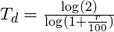

```{r, setup, include=FALSE}
knitr::opts_chunk$set(echo = FALSE)
```


# Indiana COVID-19 Tracker
(Charts updated between noon and 1pm ET and at 6 pm ET)

Repository to track COVID-19 data statewide and by county. State and County data for positive tests and deaths are gathered from The New York Times COVID-19 [repository](https://github.com/nytimes/covid-19-data) and the Indiana State Department of Heath Twitter [account](https://twitter.com/StateHealthIN?ref_src=twsrc%5Egoogle%7Ctwcamp%5Eserp%7Ctwgr%5Eauthor).  

```{r}
ind_line_path <- glue::glue("plots/ind-combo-line-{params$ind_combo_date}.png")
knitr::include_graphics(ind_line_path)
``` 

   * Each point is the total cases that have accumulated until that date. The lines show the exponential nature of the spread of the virus.  
   * *Doubling time* is the amount of time it would take for the current total to double. It assumes that the rate of change is constant. The doubling time shown here assumes that the total change from yesterday to today (i.e. single day *growth rate*) will remain constant in the future. As we'll see in the next chart, it's not a valid assumption in this situation, but it's interesting as a hypothetical. 
   * The equation for doubling time, T~d~, where r is the growth rate.  
<center>
```{r, align="center"}

```
</center>
```{r}
density_pos_path <- glue::glue("plots/density-pos-line-{params$density_pos_date}.png")
knitr::include_graphics(density_pos_path)
```

   * This chart shows the single day growth rates over a period of time for each state. LOESS regression curves are used here instead of a connected line graph of the actual data because the fluctuations of the data would obscure the trends.  
   * These curves can be used to compare the effectiveness of state responses. Population density is an important factor for how quickly a virus spreads. Therefore, it's a fairer comparison to use states with similar population densities if we want to get an idea of how well Indiana's governmental response has been.  
   * Doubling times, as shown in the previous equation, are calculated from growth rates, so I've included a second y-axis to show how these have changed over time as well.  
   * Previous versions of this chart included Georgia. As of 2020-04-12, Georgia started separating non-state residents from their patient counts. Neither The New York Times nor Georgia adjusted the counts prior to the change. Without an adjustment, it destroyed the coherence of the data, so I've replaced them with South Carolina.  

```{r}
region_dea_path <- glue::glue("plots/region-dea-line-{params$region_dea_date}.png")
knitr::include_graphics(region_dea_path)
```

```{r}
region_pos_path <- glue::glue("plots/region-pos-line-{params$region_pos_date}.png")
knitr::include_graphics(region_pos_path)
```

   * The y-axis has been transformed to the log base-10 scale and taking the logarithm of an exponential curve creates a straight line. It's easier for us to compare to slopes and trends of straight(-ish) lines than exponential curves.  
   * The slope is an estimation of the average percentage increase per day and are estimated using the log-linear regression equation in the top left corner. As these lines start to curve downward, it indicates the data is becoming less exponential. The estimation errors become larger and the model less appropriate.  

```{r}
county_pos_path <- glue::glue("plots/county-pos-bar-{params$county_pos_date}.png")
knitr::include_graphics(county_pos_path)
```

   * The percent changes are estimated using the same regression equation as the regional percent changes in the previous chart except I'm using county data here.  
   * Only the top 20 counties according to average percent change are shown. Only counties that have had at least 5 positive cases for a week or more are considered. I'm trying to weed out the high rate estimates that are due to a spike in testing.  As tests become more widely available, I'll remove this constraint.  

