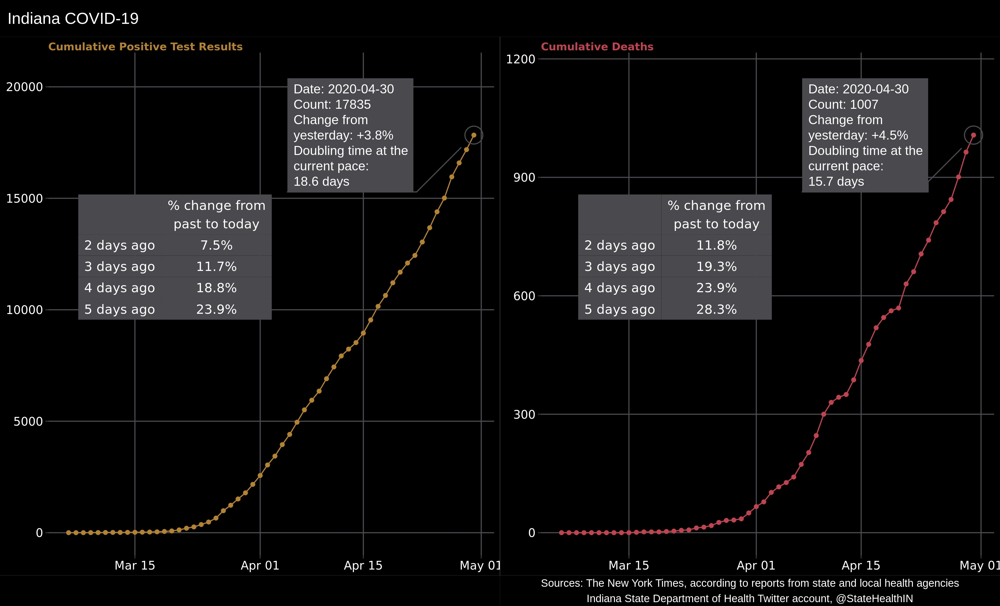
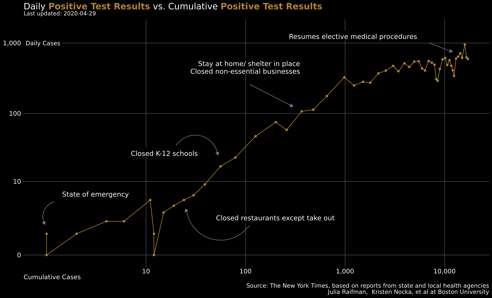
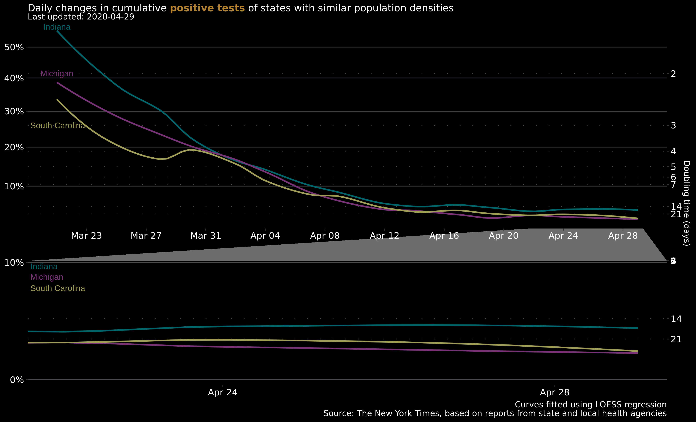
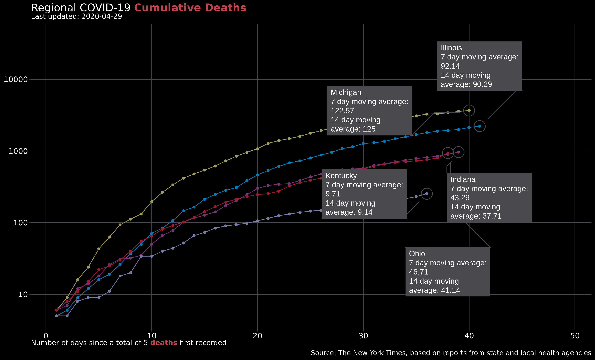
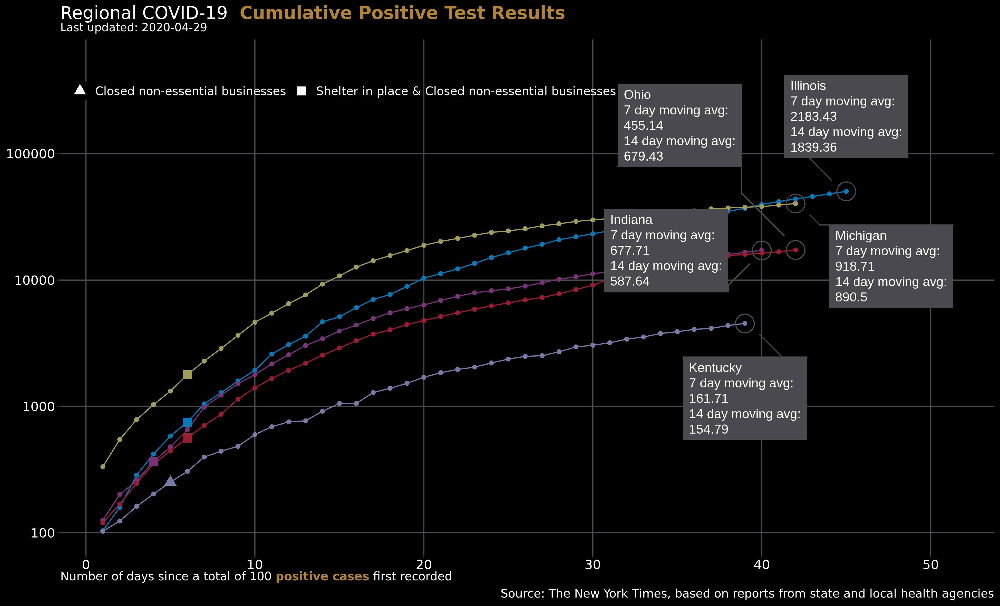
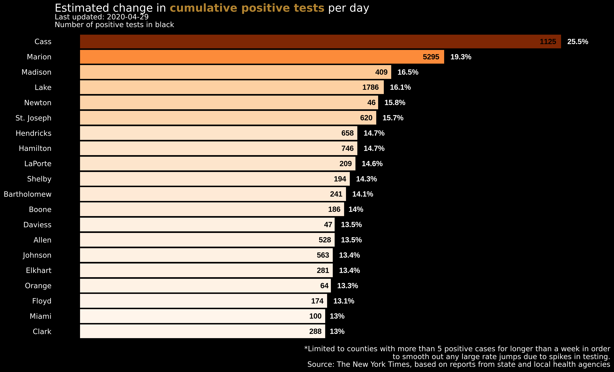
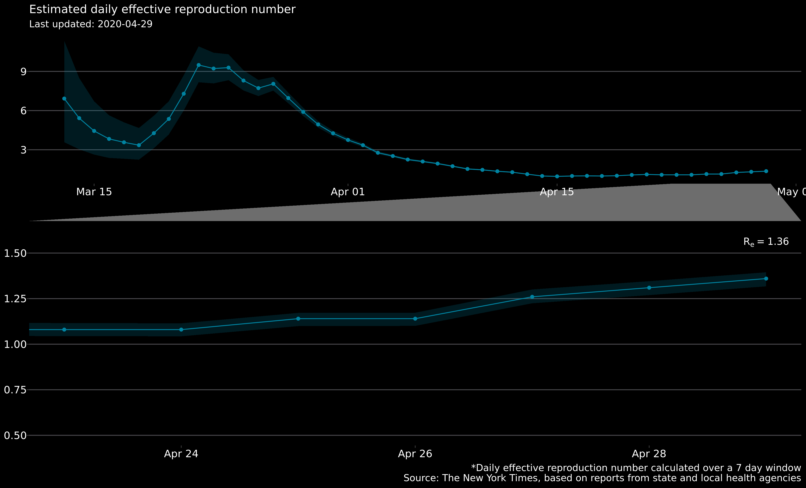

# Indiana COVID-19 Tracker

(Charts updated between noon and 1pm ET and at 6:30 pm ET)

Repository to track COVID-19 data statewide and by county. State and
County data for positive tests and deaths are gathered from The New York
Times COVID-19 [repository](https://github.com/nytimes/covid-19-data)
and the Indiana State Department of Heath Twitter
[account](https://twitter.com/StateHealthIN?ref_src=twsrc%5Egoogle%7Ctwcamp%5Eserp%7Ctwgr%5Eauthor).
State policy
[data](https://docs.google.com/spreadsheets/d/1zu9qEWI8PsOI_i8nI_S29HDGHlIp2lfVMsGxpQ5tvAQ/edit#gid=0)
comes from Julia Raifman, Kristen Nocka, et al at Boston University.

  - Each point is the total cases that have accumulated until that date.
    The lines show the exponential nature of the spread of the virus at
    the beginning of the epidemic and changes in trend as policy and
    behavior changes.  
  - *Doubling time* is the amount of time it would take for the current
    total to double. It assumes that the rate of change is constant. The
    doubling time shown here assumes that the total change from
    yesterday to today (i.e. single day *growth rate*) will remain
    constant in the future. As we’ll see in another chart, it’s not a
    valid assumption in this situation, but it’s interesting as a
    hypothetical.
  - The equation for doubling time, Td, where r is the growth
    rate.

  - This chart shows the number of daily positive cases on the y-axis
    versus the cumulative total of positive cases on the x-axis, where
    both axes are on a logarithmic scale. As policy measures are taken
    and the transmission rate lessens, the trend will decline and become
    increasingly vertical.

  - This chart shows the single day growth rates over a period of time
    for each state. LOESS regression curves are used here instead of a
    connected line graph of the actual data because the fluctuations of
    the data would obscure the trends.  
  - These curves can be used to compare the effectiveness of state
    responses. Population density is a potential factor for how quickly
    a virus spreads through a state. Therefore, a fairer comparison
    might be to use states with similar population densities if we want
    to get an idea of how well Indiana’s governmental response has
    been.  
  - Doubling times, as shown in the previous equation, are calculated
    from growth rates, so I’ve included a second y-axis to show how
    these have changed over time as well.  
  - Previous versions of this chart included Georgia. As of 2020-04-12,
    Georgia started separating non-state residents from their patient
    counts. Neither The New York Times nor Georgia adjusted the counts
    prior to the change. Without an adjustment, it destroyed the
    coherence of the data, so I’ve replaced them with South Carolina.

  - The y-axis has been transformed to the log base-10 scale. Slopes and
    trends of straight(-ish) lines are easier to compare than
    exponential curves.  
  - 7-day moving averages *greater* than 14 day moving averages indicate
    an *increasing* trend of positive cases or deaths.  
  - 7-day moving averages *less* than 14 day moving averages indicate a
    *decreasing* trend in positive cases or deaths.

  - The top 20 counties according to estimated average percent change
    are shown. Counties at the top are experiencing the highest average
    growth rates in positive test results.
  - The percent changes are estimated using county data in a log-linear
    model.  
  - Only counties that have had at least 5 positive cases for a week or
    more are considered. I’m trying to weed out the high rate estimates
    that are due to a spike in testing. As tests become more widely
    available, I’ll remove this constraint.

  - The instantaneous effective reproduction number, Re is an
    estimate of the average number of people that an infected person is
    spreading the virus to for that period.  
  - Estimates *slighly lower* than 1 indicate that the spread of the
    virus is decreasing. Estimates *slightly larger* than 1 indicate a
    slow spread of the virus. Estimates of *2 or greater* mean the virus
    is spreading rapidly.  
  - Re is estimated over a 7-day window, and the shaded area
    shows the 95% credible interval.
  - Further details on this metric can be found at a research
    [site](https://cbdrh.github.io/ozcoviz/#national-level-r_t) set-up
    by South Western Sydney Clinical School and the Centre for Big Data
    Research in Health.
