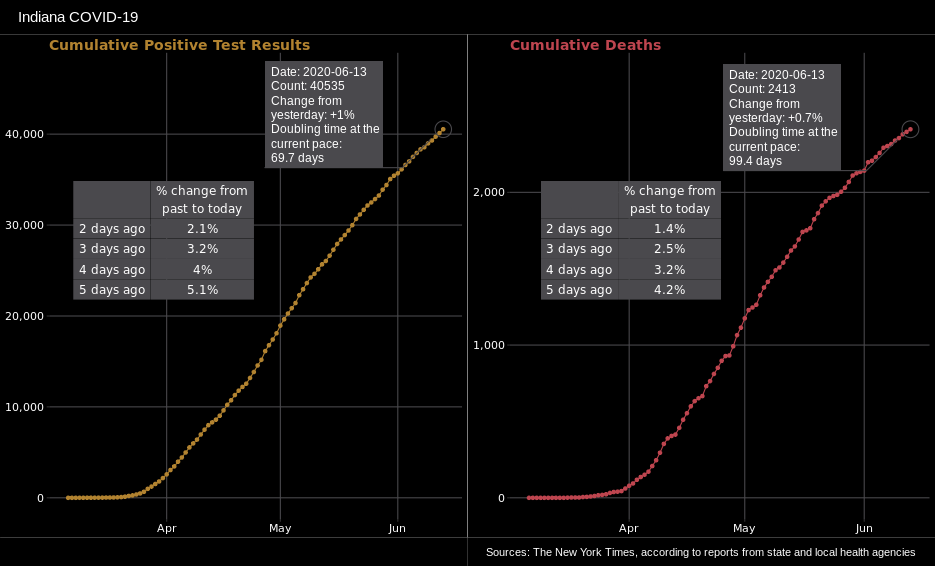
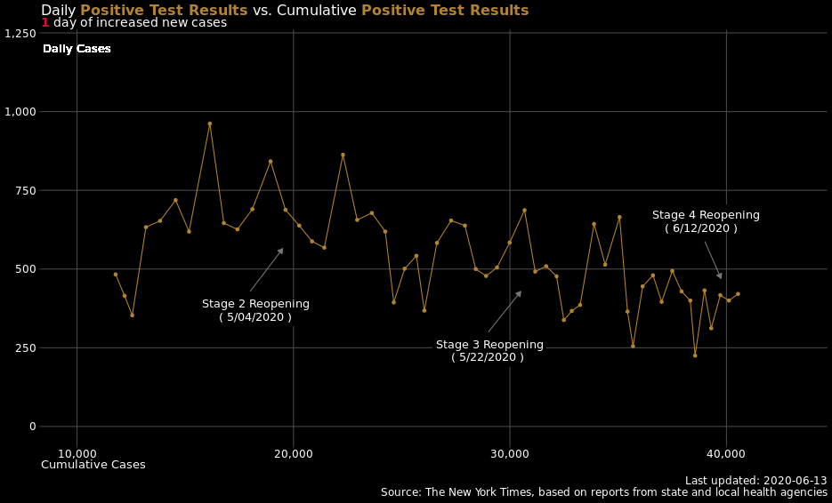
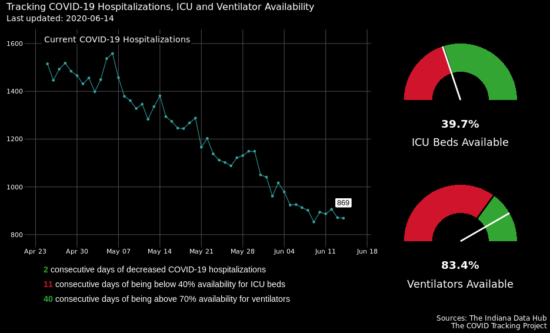
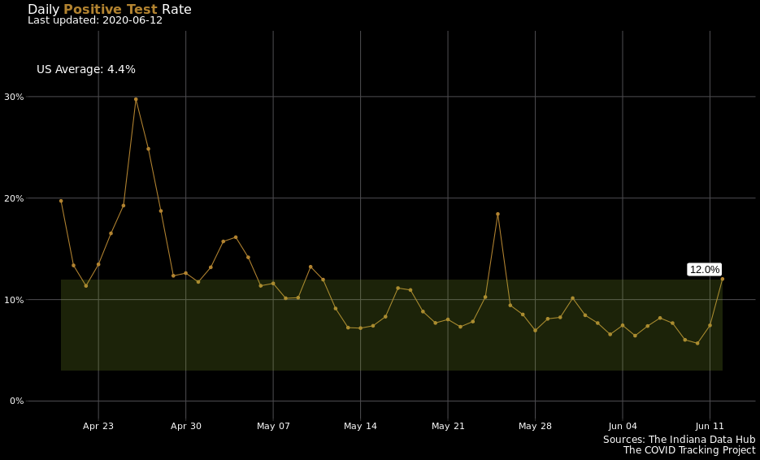
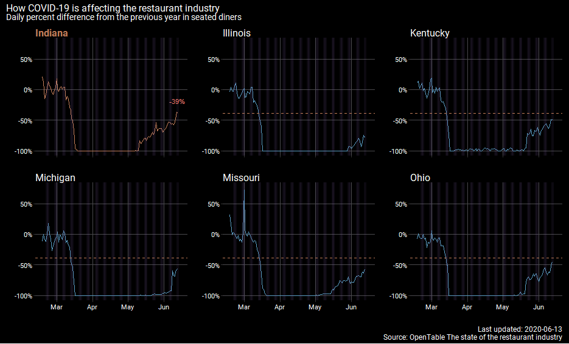
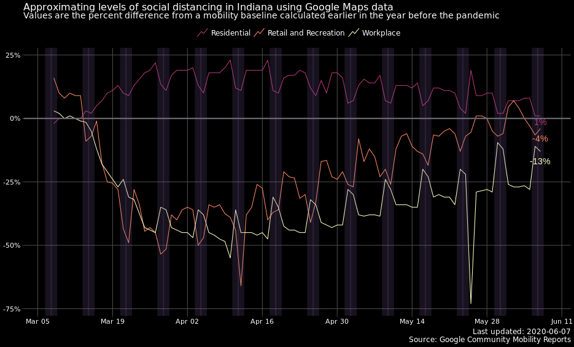
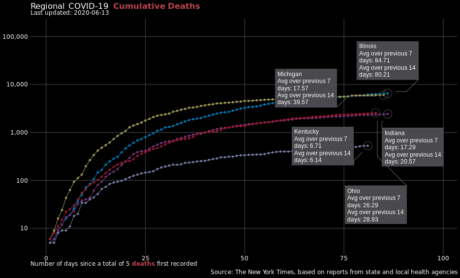
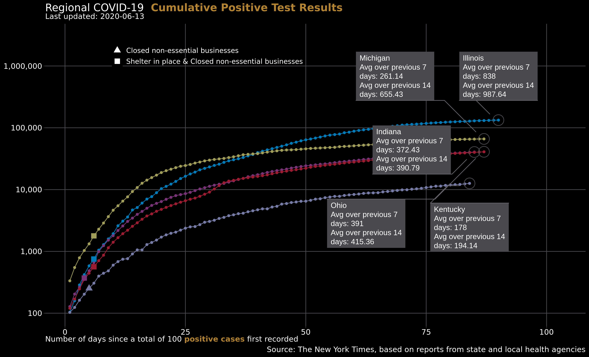
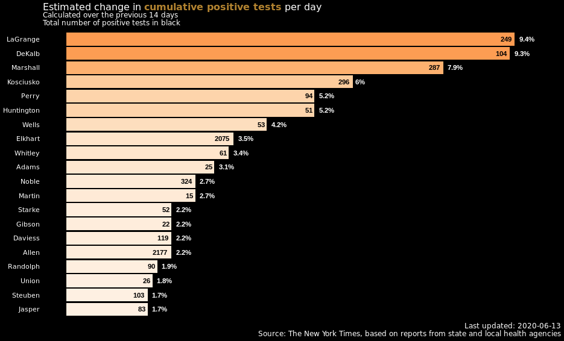
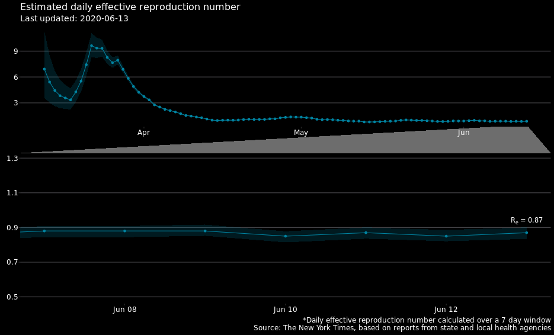

# Indiana COVID-19 Tracker

Charts updated between noon and 1pm ET and at 6:30 pm ET  
Changelog located in
[NEWS.md](https://github.com/ercbk/Indiana-COVID-19-Tracker/blob/master/NEWS.md)

Repository to track COVID-19 data statewide and by county. Most of the
State and County data for positive tests and deaths are gathered from
The New York Times COVID-19
[repository](https://github.com/nytimes/covid-19-data) and The Indiana
Data [Hub](https://hub.mph.in.gov/dataset). State policy
[data](https://docs.google.com/spreadsheets/d/1zu9qEWI8PsOI_i8nI_S29HDGHlIp2lfVMsGxpQ5tvAQ/edit#gid=0)
comes from Julia Raifman, Kristen Nocka, et al at Boston University.

Governor Holcomb has begun scaling back policies aimed at stopping the
spread of COVID-19. Much of his plan seems to follow the White House
[plan](https://www.whitehouse.gov/openingamerica/), and both are simliar
to the
[guidelines](https://www.aei.org/research-products/report/national-coronavirus-response-a-road-map-to-reopening/)
published by the American Enterpise Institute (AEI) and Johns Hopkins.
Neither Governor Holcomb’s nor the White House’s plan includes the
snapback (i.e. reverting to a previous stage) triggering conditions
listed in the AEI proposal. Along with tracking virus spread metrics,
I’ll also be tracking as many of these triggers as I can with the data
that’s available.

  - Each point is the total cases that have accumulated until that date.
    The lines show the exponential nature of the spread of the virus at
    the beginning of the epidemic and changes in trend as policy and
    behavior changes.  
  - *Doubling time* is the amount of time it would take for the current
    total to double. It assumes that the rate of change is constant. The
    doubling time shown here assumes that the total change from
    yesterday to today (i.e. single day *growth rate*) will remain
    constant in the future. As we’ll see in another chart, it’s not a
    valid assumption in this situation, but it’s interesting as a
    hypothetical.

  - This chart shows the number of daily positive cases on the y-axis
    versus the cumulative total of positive cases on the x-axis.  
  - In the AEI reopening guidelines, one of the triggers for returning
    to stage one is five or more consecutive days where the value of
    daily cases has increased.  
  - Details on the various stages of re-opening can be found at
    [Back-on-Track Indiana](https://backontrack.in.gov/2348.htm).

  - Even though Governor Holcomb hasn’t explicitly stated the conditions
    that would necessitate a reversal of course to a previous stage, he
    did mention some benchmarks when discussing his guiding principles
    in his re-opening [speech](https://backontrack.in.gov/2362.htm). By
    negating a few of these, we can infer what some of the snapback
    conditions might entail.
      - An increase for 14 consecutive days in the daily total of those
        hospitalized for COVID-19.  
      - The proportion of available ICU beds to total ICU beds being
        below 40% for 14 consecutive days.
      - The proportion of available ventilators to total ventilators
        being below 70% for 14 consecutive days.

  - The Positive Test Rate is the number of positive test results
    divided by the number of tests administered over a period of time.
  - According to the World Health Organization (WHO), the positive test
    rate can be a good indicator of whether a virus testing program is
    sufficient. It finds that successful programs have a positive test
    rate in the range of 3% to 12%.  
  - A Johns Hopkins
    [article](https://coronavirus.jhu.edu/testing/testing-positivity)
    calculates this rate for states over three day windows and uses the
    WHO benchmark to classify state programs as adequate or not.  
  - Indiana Data Hub tends to revise its counts as it continues to
    collect more data. When analyzing this chart, it would be prudent
    not to assess the last few rates too confidently as they are likely
    to change.  
  - The green, horizontal bar shows the WHO recommended range from 3% to
    12%.  
  - U.S. average calculated using data from [The COVID Tracking
    Project](https://covidtracking.com/api).

  - OpenTable is a service for reviewing and making reservations at
    restaurants. On its “The state of the restaurant industry”
    [page](https://www.opentable.com/state-of-industry), it provides a
    couple different datasets that use reservation and food order data
    to summarize the state of the restaurant industry regionally by
    city, state, and country.  
  - The dataset being visualized uses reservation data from a sample of
    restaurants across Indiana. Each data point is the median daily
    percent difference in seated diners from the previous year to this
    year. So, if the day is the first Tuesday in June 2020, then the
    comparison is between that day and the first Tuesday of June 2019.  
  - At stages two and three, restaurants are allowed to reopen at 50%
    capacity. So, if a restaurant was fully-booked on a specific day in
    2019 and fully booked on that same day in 2020, then we’d see a 50%
    difference for that one restaurant during stages two and three. In
    stage four, restaurants can open to 75% capacity, so the
    fully-booked, percent difference benchmark becomes 25%. Numbers
    around these benchmarks could indicate the level at which hoosiers
    are responding after each re-opening stage.
  - Weekends are shown as vertical bars, and for comparison, the
    horizontal dashed line represents Indiana’s current percent
    difference.

  - Google like Apple has released some of the
    [data](https://www.google.com/covid19/mobility/) it collects from
    its Maps app that it uses to produce Community Mobility Reports and
    product recommendations.  
  - From the “About this Data” section in the Report:
      - These reports show how visits and length of stay at different
        places change compared to a baseline.
      - The baseline is the median value, for the corresponding day of
        the week, during the 5- week period Jan 3–Feb 6, 2020.  
  - Weekends are shown as vertical bars.

  - The y-axis has been transformed to the logarithmic base-10 scale.
    Slopes and trends of straight(-ish) lines are easier to compare than
    exponential curves.  
  - 7-day averages *greater* than 14 day averages indicate an
    *increasing* trend of positive cases or deaths.  
  - 7-day averages *less* than 14 day averages indicate a *decreasing*
    trend in positive cases or deaths.

  - The top 20 counties according to estimated average percent change
    are shown. Counties at the top are experiencing the highest average
    growth rates in positive test results.
  - The average percent changes are estimated using county data in a
    log-linear model.

  - The instantaneous effective reproduction number, Re is an
    estimate of the average number of people that an infected person is
    spreading the virus to for that time window.  
  - Estimates *slighly lower* than 1 indicate that the spread of the
    virus is decreasing. Estimates *slightly larger* than 1 indicate a
    slow spread of the virus. Estimates of *2 or greater* mean the virus
    is spreading rapidly.  
  - Re is estimated over a 7-day window, and the shaded area
    shows the 95% credible interval.
  - Further details on this metric can be found at a research
    [site](https://cbdrh.github.io/ozcoviz/#national-level-r_t) set-up
    by South Western Sydney Clinical School and the Centre for Big Data
    Research in Health.
