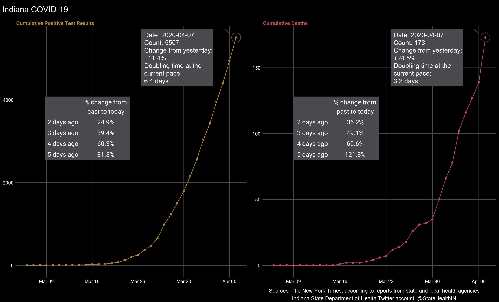
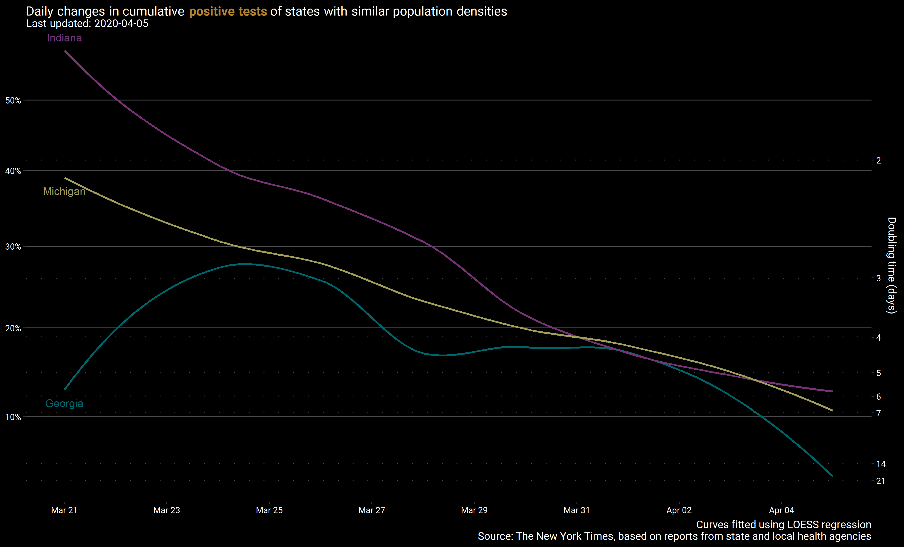
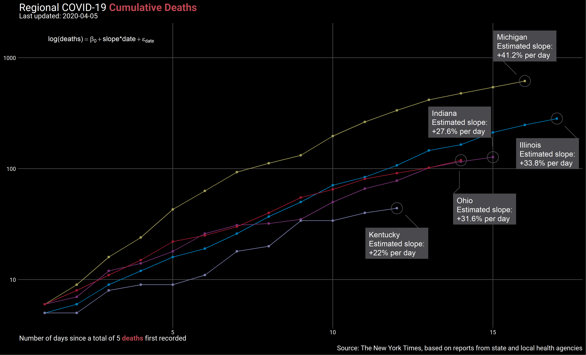
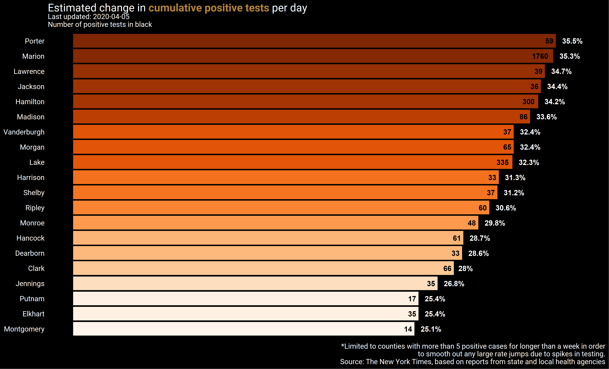

# Indiana COVID-19 Tracker

Repository to track COVID-19 data statewide and by county. State and
County data for positive tests and deaths are gathered from The New York
Times COVID-19 [repository](https://github.com/nytimes/covid-19-data)
and the Indiana State Department of Heath Twitter
[account](https://twitter.com/StateHealthIN?ref_src=twsrc%5Egoogle%7Ctwcamp%5Eserp%7Ctwgr%5Eauthor).

